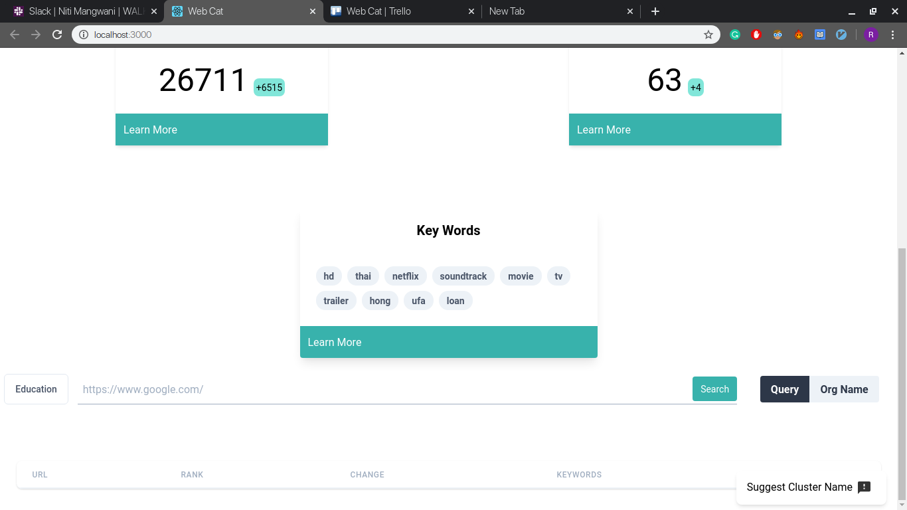

## Web Cat  
Web Cat is a market analytics tool which I built at @Walkover. It scrapes top 1 million site genrating the most traffic and categorizes them. It then genrates average ranking and keywords of particular category from the sites and provides a informative view to the user. Also it provides the feature to categorizes any new site and show simillar sites which are already in database.

All of this is packed in a clean but detailed UI.

